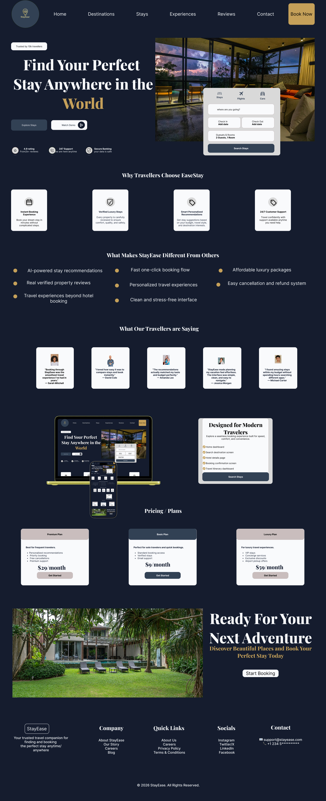

# HexSoftwares_Project_Name.
# StayEase — Travel Booking Landing Page UI/UX Case Study

---

# Project Overview

StayEase is a modern travel booking platform designed to help users discover, compare, and book accommodations easily from one platform.

This project focused on creating a clean and visually engaging landing page that improves user experience, simplifies navigation, and builds trust for travelers looking for comfortable stays around the world.

---

# Problem Statement

Many travel booking websites feel overcrowded and difficult to navigate. Users often struggle with:

- Complex booking flows
- Poor visual hierarchy
- Too much information at once
- Difficulty comparing travel options
- Lack of trust in property listings

The challenge was to design a landing page that feels modern, simple, and easy to use while still maintaining a premium travel experience.

---

# Project Goal

The main goal of this project was to:

- Create a seamless booking experience
- Improve content readability
- Increase user trust
- Simplify travel discovery
- Encourage faster booking decisions

---

# My Design Process

## 1. Research & Inspiration

I explored several travel and accommodation websites to understand:

- Common user behaviors
- Booking patterns
- Modern UI trends
- Layout structures
- Navigation systems

This helped me understand how users interact with travel products and what makes booking experiences feel smooth and stress-free.

---

## 2. Brand Identity

I created the brand name **StayEase** to communicate:

- Comfort
- Simplicity
- Accessibility
- Luxury travel experiences

The dark navy and gold color palette was chosen to give the interface a premium and trustworthy appearance.

---

## 3. Wireframing

Before designing the final UI, I planned the layout structure by organizing the page into sections:

- Hero section
- Booking card
- Features section
- Testimonials
- Pricing plans
- Final call-to-action
- Footer

This helped improve layout consistency and content hierarchy.

---

## 4. UI Design

During the UI stage, I focused on:

- Clean spacing
- Visual hierarchy
- Typography consistency
- Card-based layouts
- User-friendly navigation
- Responsive structure

I used large headings and organized sections carefully so users could scan information quickly.

---

# Design Decisions

## Hero Section

The hero section was designed to immediately communicate the purpose of the platform while encouraging users to begin booking quickly.

The booking card was placed directly inside the hero section to reduce unnecessary navigation steps.

---

## Feature Cards

Feature cards were added to explain key benefits clearly:

- Verified luxury stays
- AI-powered recommendations
- Secure booking process
- 24/7 support

This helps build user trust early in the experience.

---

## Testimonials

User testimonials were included to improve credibility and provide social proof for new users visiting the platform.

---

## Pricing Plans

Pricing sections help users compare available travel plans quickly and make informed decisions.

---

## Final CTA Section

The final call-to-action section encourages users to complete bookings after exploring the platform.

---

# Tools Used

- Figma
- Auto Layout
- Components
- Typography System
- Color Styles
- Grid Layout

---

# Color Palette

| Color | Hex Code |
|---|---|
| Dark Navy | `#0D1B3D` |
| Gold Accent | `#D4A24C` |
| Soft White | `#F8F8F8` |
| Gray Text | `#A7A7A7` |

---

# Typography

- Headings: Playfair Display
- Body Text: Poppins

The typography combination was chosen to balance elegance with readability.

---

# What This Design Solves

This design helps users:

- Discover accommodations faster
- Navigate booking options easily
- Compare travel plans comfortably
- Feel more confident while booking
- Enjoy a cleaner browsing experience

---

# Challenges Faced

One major challenge was balancing luxury aesthetics with usability.

I wanted the interface to feel premium without overwhelming users with too much information or visual clutter.

Another challenge was maintaining consistency across multiple sections while ensuring the design remained visually engaging.

---

# Outcome

This project improved my understanding of:

- Landing page structure
- User-centered design
- Travel product UX
- Visual hierarchy
- Responsive layouts
- UI consistency

It also strengthened my ability to design interfaces that combine aesthetics with functionality.

---

# Conclusion

Designing StayEase taught me that great UI design is not only about creating beautiful screens but also about building experiences that feel smooth, trustworthy, and easy to use.

Every section of this landing page was intentionally designed to guide users naturally from discovery to booking with minimal friction.

---

# Preview

---

# Designer

**Blessing Onyinye Chukwuekwe**  
UI/UX Designer

---
